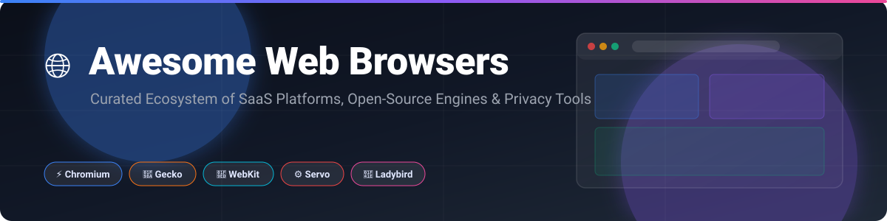

  

  
  
  
  
  

# 🌐 Awesome Web Browsers

> 🚀 A curated list of top SaaS web browsers, open-source browser projects, web rendering engines (**Chromium**, **Gecko**, **WebKit**, **Servo**, **Ladybird**), and privacy-focused browsing solutions.

📅 **Last updated: October 2026**

---

## 📋 Table of Contents

- [📊 Market Overview & Ecosystem Structure](#-market-overview--ecosystem-structure)
- [🌐 SaaS & Commercial Web Browsers](#-saas--commercial-web-browsers)
- [⚡ Open-Source Web Browsers & Engines](#-open-source-web-browsers--engines)
- [🔬 Independent Engine Projects](#-independent-engine-projects)
- [🏗️ Browser Engine Architecture Comparison](#-browser-engine-architecture-comparison)
- [🤝 How to Contribute](#-how-to-contribute)
- [🛡️ Disclaimer & Security Considerations](#-disclaimer--security-considerations)
- [💖 Support & Sponsorship](#-support--sponsorship)
- [📈 Star History](#-star-history)

---

## 📊 Market Overview & Ecosystem Structure

> 💡 **Estimated Market Size:** The global web browser ecosystem (encompassing browser-driven digital advertising, search engine licensing, web extension ecosystems, and enterprise workspace platforms) represents an estimated **$200+ Billion annual market**.  
> 📈 **Market Concentration:** The web browser sector is **highly concentrated (winner-take-all market structure)**, dominated by Google Chrome (~65% global market share), Apple Safari (~18%), and Microsoft Edge (~5%). Independent, open-source, and privacy-centric browsers compete for the remaining ~12% market share.

---

## 🌐 SaaS & Commercial Web Browsers

The table below lists leading commercial and SaaS web browser platforms, sorted by **Company Size / Valuation / Revenue** in descending order.

| Browser / Product | Description | Company Size / Valuation / Revenue | Pricing (Starting Tier) | Free Tier Limit |
| :--- | :--- | :--- | :--- | :--- |
| **[Apple Safari](https://www.apple.com/safari/)** 🧭 | Apple's flagship browser powered by WebKit, featuring hardware acceleration and tight OS integration. | **~$3.4 Trillion Market Cap** *(Apple Inc. / $385B Revenue)* | **$0.00 / Free** | **Unlimited free usage** across all macOS, iOS, and iPadOS devices. |
| **[Microsoft Edge](https://www.microsoft.com/edge)** 🌊 | Chromium-based browser with vertical tabs, Copilot AI integration, and enterprise security. | **~$3.1 Trillion Market Cap** *(Microsoft Corp / $245B Revenue)* | **$0.00 / Free** | **Unlimited free personal browsing**; enterprise controls via Microsoft 365 ($6.00/user/mo). |
| **[Google Chrome](https://www.google.com/chrome/)** 🔴 | Market-leading browser built on Chromium, integrated with Google Cloud services and extensions. | **~$2.1 Trillion Market Cap** *(Alphabet Inc. / $307B Revenue)* | **$0.00 / Free** | **Unlimited free usage** for personal browsing; Chrome Enterprise Premium available at $6.00/user/mo. |
| **[Opera Browser](https://www.opera.com/)** ⭕ | Feature-dense Chromium browser with built-in VPN, ad blocker, and AI sidebar tools. | **~$1.4 Billion Market Cap** *(NASDAQ: OPRA / $397M Revenue)* | **$0.00 / Free** | **Unlimited free usage** with standard VPN & ad blocker; optional Opera Pro VPN at $4.00/mo. |
| **[Arc Browser](https://arc.net/)** 🎨 | Radical sidebar-first productivity browser from The Browser Company, built for workflow spaces. | **$550 Million Valuation** *(The Browser Company / ~$10M Revenue)* | **$0.00 / Free** | **Unlimited free access** to all workspaces, sidebar tabs, and customization tools. |
| **[Brave Browser](https://brave.com/)** 🦁 | Privacy-focused Chromium browser with built-in Brave Shields, ad-blocking, and Brave Search. | **~$300 Million Valuation** *(Brave Software / ~$50M Revenue)* | **$0.00 / Free** | **Unlimited free ad-blocking & privacy protection**; optional VPN add-on at $9.99/mo. |
| **[DuckDuckGo Browser](https://duckduckgo.com/app)** 🦆 | Privacy-centric browser featuring automatic tracker blocking, one-tap Fire Button, and Duck Player. | **~$100+ Million Revenue** *(DuckDuckGo, Inc.)* | **$0.00 / Free** | **Unlimited free private search and tracker blocking**; optional Privacy Pro bundle at $9.99/mo. |
| **[Vivaldi](https://vivaldi.com/)** 🎭 | Power-user Chromium browser offering deep customization, tab stacking, and built-in note taking. | **~$15 Million Revenue** *(Vivaldi Technologies AS)* | **$0.00 / Free** | **Unlimited free usage** for desktop and mobile with full custom UI features. |
| **[Tor Browser](https://www.torproject.org/)** 🧅 | Privacy and anti-censorship browser utilizing onion routing and Firefox ESR anti-fingerprinting. | **~$7 Million Annual Budget** *(The Tor Project 501(c)(3))* | **$0.00 / Free** | **Unlimited free anonymous browsing** via the decentralized Tor network. |

---

## ⚡ Open-Source Web Browsers & Engines

The following open-source browser repositories and rendering engines are sorted by **GitHub Star Count** (descending).

| Repository & Name | GitHub Stars | Description | Engine / Base |
| :--- | :--- | :--- | :--- |
| **[Ladybird](https://github.com/LadybirdBrowser/ladybird)** 🐞 |  | Independent web browser and C++ web rendering engine built from scratch. | LibWeb *(Independent)* |
| **[Zen Browser](https://github.com/zen-browser/desktop)** ☯️ |  | Firefox ESR-based browser featuring vertical tabs, split view, and modern UI. | Gecko *(Firefox ESR)* |
| **[Servo Engine](https://github.com/servo/servo)** ⚙️ |  | Independent, parallel, memory-safe web engine written in Rust under Linux Foundation Europe. | Servo *(Independent Rust)* |
| **[ungoogled-chromium](https://github.com/ungoogled-software/ungoogled-chromium)** 🔓 |  | Chromium fork stripped of Google integration, background tracking, and proprietary binaries. | Chromium |
| **[Chromium Core](https://github.com/chromium/chromium)** 🌐 |  | The open-source browser project behind Chrome, Edge, Brave, Opera, Vivaldi, and Arc. | Blink / V8 |
| **[Brave Browser](https://github.com/brave/brave-browser)** 🦁 |  | Open-source foundation for Brave Browser across Android, iOS, Windows, macOS, and Linux. | Chromium / Brave Core |
| **[Helium Browser](https://github.com/imputnet/helium)** 🎈 |  | Transparent Chromium browser focused on performance, privacy, and built-in ad protection. | Chromium |
| **[Carbonyl](https://github.com/fathyb/carbonyl)** 💻 |  | Chromium running inside the terminal with 60 FPS video, WebGL, and low memory usage. | Chromium |
| **[qutebrowser](https://github.com/qutebrowser/qutebrowser)** ⌨️ |  | Keyboard-focused, Vim-like web browser written in Python with QtWebEngine. | QtWebEngine *(Blink)* |
| **[WebKit Engine](https://github.com/WebKit/WebKit)** 🧭 |  | Open-source rendering engine powering Apple Safari, iOS browsers, and Linux GTK apps. | WebKit |
| **[Min Browser](https://github.com/minbrowser/min)** ⚡ |  | Fast, minimal browser built with Electron, featuring tab grouping and built-in ad blocking. | Electron / Blink |
| **[Floorp](https://github.com/Floorp-Projects/Floorp)** 🌸 |  | Japanese Firefox fork with vertical tabs, workspaces, and customizable interface. | Gecko *(Firefox)* |
| **[Waterfox](https://github.com/BrowserWorks/waterfox)** 💧 |  | Firefox-based browser emphasizing privacy defaults, telemetry removal, and customization. | Gecko |
| **[DuckDuckGo Android](https://github.com/duckduckgo/Android)** 🤖 |  | DuckDuckGo's open-source mobile browser for Android with built-in tracker blocking. | Android WebView |
| **[Mozilla Gecko Mirror](https://github.com/mozilla/gecko-dev)** 🦊 |  | Official read-only Git mirror of Mozilla's Gecko web rendering engine. | Gecko |
| **[Brave Core C++](https://github.com/brave/brave-core)** 🛠️ |  | C++ core framework and browser engine modifications powering Brave Desktop. | Chromium |
| **[Mullvad Browser](https://github.com/mullvad/mullvad-browser)** 🛡️ |  | Anti-fingerprinting browser created by Mullvad and the Tor Project for non-Tor browsing. | Gecko *(Firefox ESR)* |
| **[Luakit](https://github.com/luakit/luakit)** 🌙 |  | Fast micro-browser framework for Linux/BSD using WebKitGTK+ and configured via Lua. | WebKitGTK+ |
| **[Otter Browser](https://github.com/OtterBrowser/otter-browser)** 🦦 |  | Project recreating the classic UI and behavior of Opera 12.x using Qt5. | QtWebEngine |
| **[DuckDuckGo iOS](https://github.com/duckduckgo/iOS)** 📱 |  | Official open-source iOS privacy browser app from DuckDuckGo. | WKWebView |
| **[Dillo Browser](https://github.com/dillo-browser/dillo)** 🦕 |  | Ultra-lightweight graphical browser written in C/C++ focusing on speed and minimal RAM. | Dillo Engine |

---

## 🔬 Independent Engine Projects

While the vast majority of web browsers rely on **Blink (Chromium)**, **Gecko (Firefox)**, or **WebKit (Safari)**, a small group of ambitious projects is working to maintain engine diversity:

- 🐞 **[Ladybird Engine (LibWeb)](https://github.com/LadybirdBrowser/ladybird)** — A ground-up browser and rendering engine written in C++. Supported by the non-profit Ladybird Browser Initiative.
- ⚙️ **[Servo Engine](https://github.com/servo/servo)** — A parallel, memory-safe web rendering engine written in Rust, governed by Linux Foundation Europe. Designed for high performance and embeddability.

---

## 🏗️ Browser Engine Architecture Comparison

| Engine | Core Maintainer | Primary Language | Major Browsers Using Engine | License |
| :--- | :--- | :--- | :--- | :--- |
| **Blink / V8** ⚡ | Google / Chromium Project | C++ | Chrome, Edge, Brave, Opera, Vivaldi, Arc | BSD-style |
| **Gecko / SpiderMonkey** 🦊 | Mozilla Foundation | C++, Rust, JS | Firefox, Zen Browser, LibreWolf, Waterfox, Tor | MPL 2.0 |
| **WebKit / JavaScriptCore** 🧭 | Apple Inc. | C++ | Safari, DuckDuckGo iOS, Orion, all iOS Browsers | BSD / LGPL |
| **Servo** ⚙️ | Linux Foundation Europe | Rust | Embedded applications, experimental builds | MPL 2.0 |
| **LibWeb** 🐞 | Ladybird Initiative | C++ | Ladybird Browser | BSD-2-Clause |

---

## 🤝 How to Contribute

Contributions are highly welcome! To add or update a browser entry:

1. 🔀 Fork this repository.
2. 📝 Update [`README.md`](file:///C:/Users/hp/Documents/Projects/Awesome-Web-Browser/README.md) following the structured format above.
3. ⭐ Ensure open-source entries include valid GitHub repository links and star badges.
4. 🚀 Submit a Pull Request with a short summary of changes.

---

## 🛡️ Disclaimer & Security Considerations

- 📌 **Community Curated:** This list is maintained for educational and research purposes. Inclusion does not equal endorsement.
- 🔒 **Security Audits:** Open-source status does not guarantee security. Always verify security patches, telemetry settings, and extension permission models.
- 🌐 **Engine Monoculture:** Chromium-based browsers share underlying core vulnerabilities. Supporting alternative web engines (Gecko, WebKit, Servo, Ladybird) helps preserve web standards diversity and resilience.

---

## 💖 Support & Sponsorship

Thank you for exploring **Awesome Web Browsers**! 🚀

If you find this repository helpful, please consider supporting it:
- 🌟 **Star** this repository on GitHub to help others discover it.
- 🔀 **Fork** and contribute new open-source projects or features.
- 📢 **Share** this list with privacy advocates, developers, and web enthusiasts.

### ☕ Sponsor & Buy Me a Coffee
If you'd like to support ongoing curation, project updates, and open-source development:

  

---

## 📈 Star History

